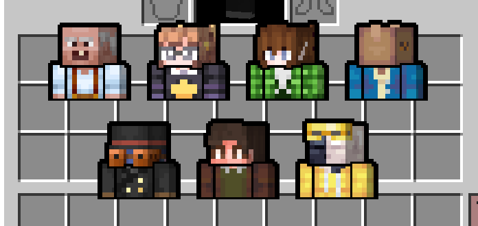
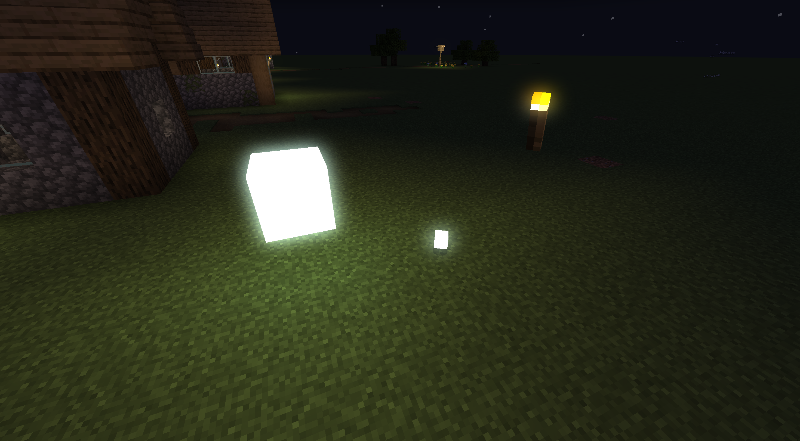
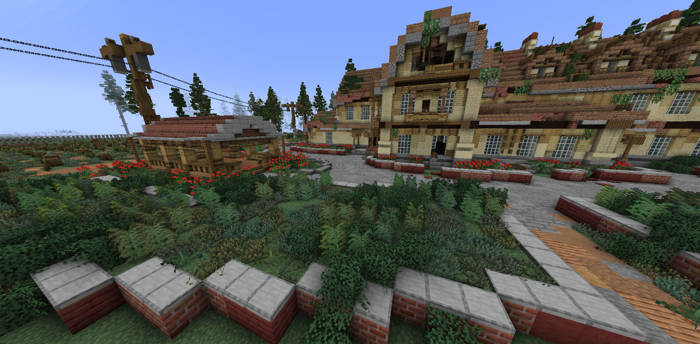
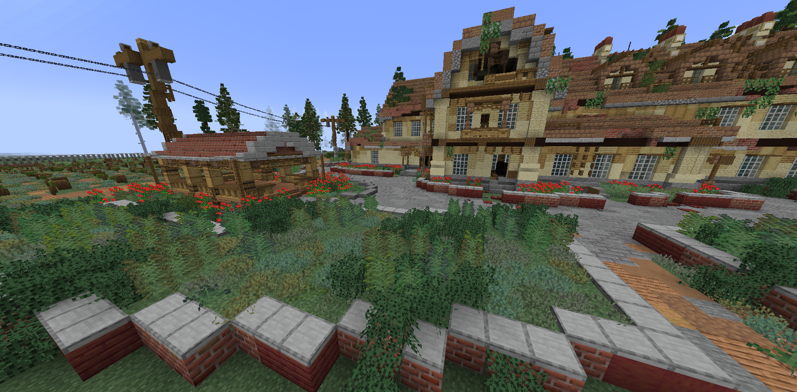
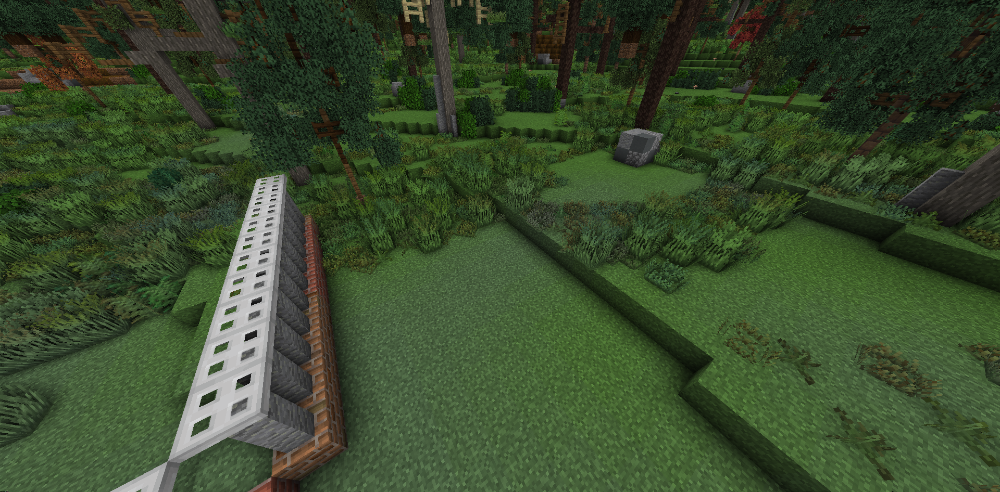
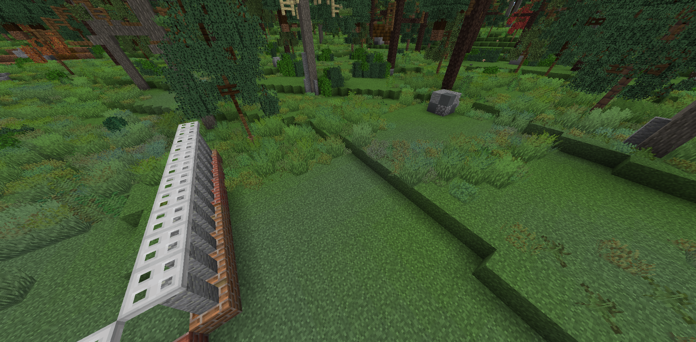
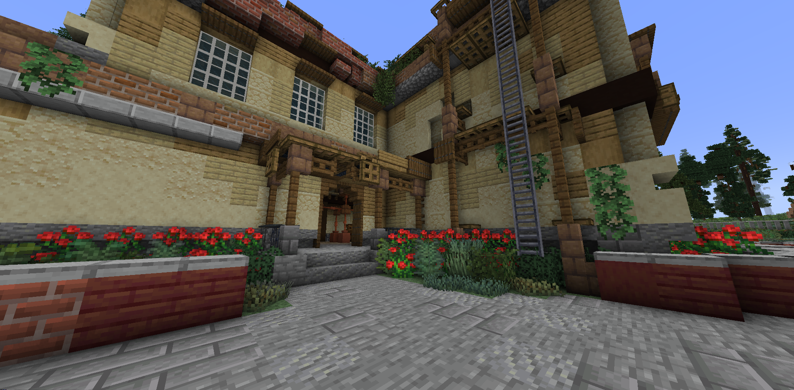

Some of my vanilla shaders that I made for fun. 
**You can use them as long as you don't sell them and provide a link to this repo.**

## GUI Avatars

A shader that renders a nice picture of any skin using player heads. 
Highly inspired by Spheya's shader (used it as reference).

## Slightly Controllable Camera

Allows to rotate the camera up to ±6-7 degrees on any axis.

https://github.com/JNNGL/vanilla-shaders/assets/45935949/f94adb60-9467-44ee-8b8c-ec41a3d084c7

## Motion Blur

Adds motion blur.

https://github.com/JNNGL/vanilla-shaders/assets/45935949/46529119-775c-49f7-b8c1-1ae2f371f452

## Bloom

## Animated Unicodes

https://github.com/JNNGL/vanilla-shaders/assets/45935949/66c9a155-ea97-4c16-823b-564b883db5aa

## Simple AO

Simple SSAO implementation.

 Simple AO          | Vanilla
:------------------:|:----------------------:
 | 
 | 
 | 

