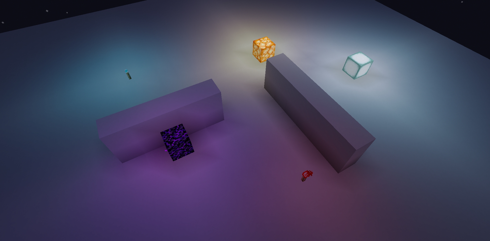
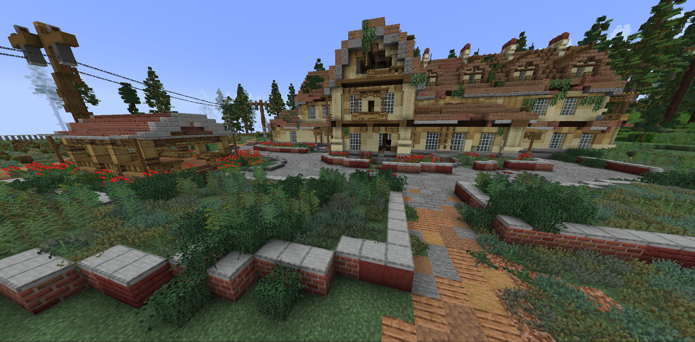
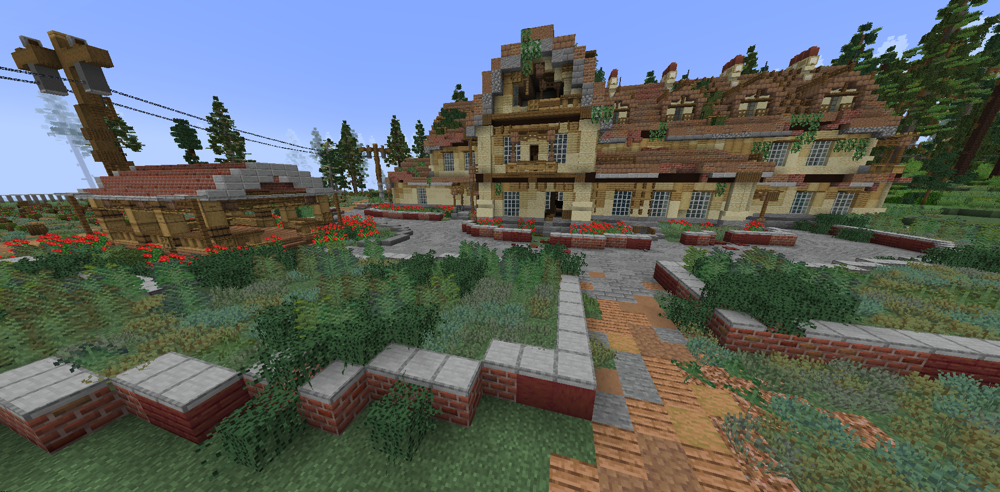
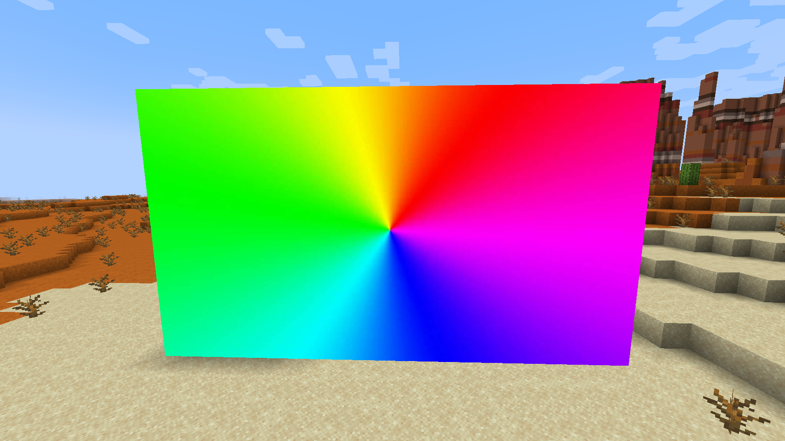
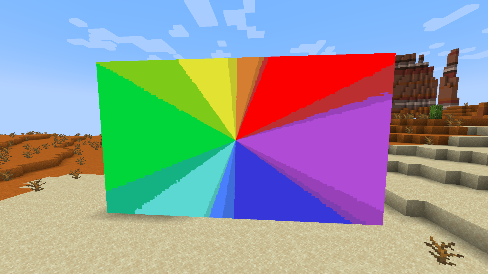
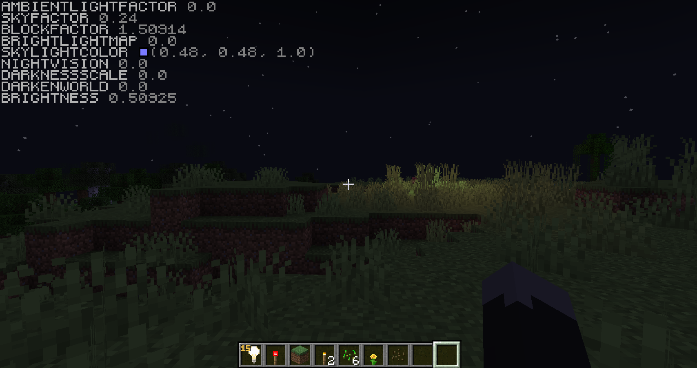
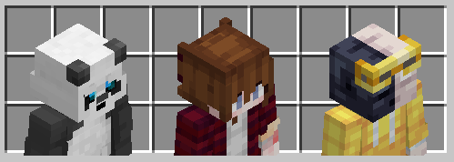
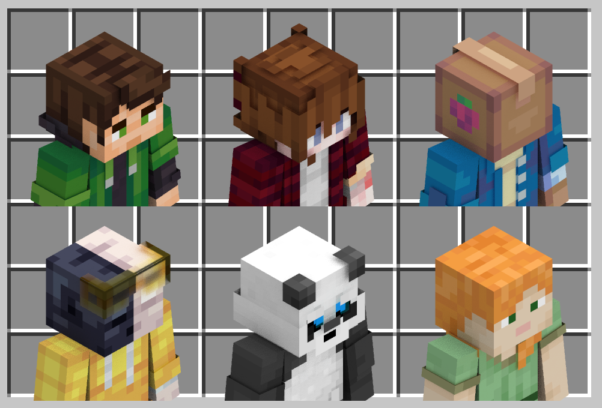

Some of my vanilla shaders that I made for fun. 
**You can use[distribute] them as long as you don't sell them and provide a link to this repo.**

## Colored Lights

> Requires Fabulous. Native Minecraft version: 1.21.3.

WIP. Adds colored lighting to vanilla minecraft.

## GUI Avatars

A shader that renders a nice picture of any skin using player heads. 
Highly inspired by Spheya's shader.

## Slightly Controllable Camera

> Requires Fabulous. Native Minecraft version: 1.20.4.

Allows to rotate the camera up to ±6-7 degrees on any axis.

https://github.com/JNNGL/vanilla-shaders/assets/45935949/f94adb60-9467-44ee-8b8c-ec41a3d084c7

## Motion Blur

> Requires Fabulous. Native Minecraft version: 1.21.

## Bloom

> Requires Fabulous. Native Minecraft version: 1.21.

## Animated Unicodes

> Native Minecraft version: 1.21.

https://github.com/JNNGL/vanilla-shaders/assets/45935949/66c9a155-ea97-4c16-823b-564b883db5aa

## Simple AO

> Requires Fabulous. Native Minecraft version: 1.21.

Simple SSAO implementation.

 SSAO               | Vanilla
:------------------:|:----------------------:
 | 
 | 
 | 

## Horizon-Based AO

> Requires Fabulous. Native Minecraft version: 1.21.

HBAO with temporal amortization.

 HBAO                | SSAO                 | Vanilla
:-------------------:|:--------------------:|:--------------------------:
 |  | 

## Minimap

> Requires Fabulous. Native Minecraft version: 1.20.4.

Proof of concept.
Translucent blocks and fluids aren't supported.

https://github.com/JNNGL/vanilla-shaders/assets/45935949/b1debe51-baaf-4fcd-b649-4ef076078eaf

## RGB Maps

> Native Minecraft version: 1.21.

Uses custom encoding to render map-arts with full RGB palette.

 RGB Maps               | Vanilla Maps
:----------------------:|:-----------------------:
 | 

## Custom Blur

> Native Minecraft version: 1.21.

Experimented with the new blur post shader. Bugs in the main menu.

https://github.com/JNNGL/vanilla-shaders/assets/45935949/d362eb4d-9347-4cae-bb6f-b16661bab960

## Lightmap uniforms

> Native Minecraft version: 24w46a.

An example of passing data to core shaders through the lightmap.

## GUI Player Models Base

A basic setup for player model rendering using player heads inside GUIs.

## Fancy Player Models

The same concept as in the base pack, but with ambient occlusion, antialiasing and specular reflections.

## Fixed FOV

> Native Minecraft version: 1.21.

Forcibly sets the player's FOV to a fixed value.

## Dynamic FOV

> Native Minecraft version: 1.21.

Allows to dynamically change the player's FOV from a modded server. 
Send the time update packet with the world age calculated as `(long) Math.floor(((float) fov + 0.5F) / 180.0F * 24000.0F)` to change the FOV. Set the world age to 0 to unlock it.

https://github.com/user-attachments/assets/f2de28c1-e860-4e0e-9ecb-bfd445ba6e3c

